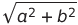
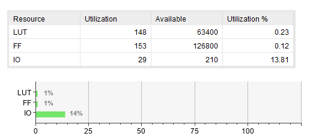

# Лабораторная работа №2

Предмет: Функциональной схемотехнике

Тема: Разработка аппаратных ускорителей математических вычислений

Вариант: 3

Выполнили:

- Братчиков Иван, P33022
- Мхитарян Сергей, P33012

## Цели работы

Получить навыки описания арифметических блоков на RTL-уровне с использованием языка описания аппаратуры Verilog HDL.

## Порядок выполнения

1. Разработайте и опишите на Verilog HDL схему, вычисляющую значение функции в соответствии с заданными ограничениями согласно варианту задания.
2. Определите область допустимых значений функции.
3. Разработайте тестовое окружение для разработанной схемы. Тестовое окружение должно проверять работу схемы не менее, чем на 10 различных тестовых векторах.
4. Проведите моделирование работы схемы и определите время вычисления результата. Схема должна тактироваться от сигнала с частотой 100 МГц.
5. Составьте отчет по результатам выполнения работы.

### Описание варианта

Вариант 3 

Функция: 

Ограничения: 1 cумматор и 2 умножителя

## Выполнение

### Схема модуля:

[Схема модуля](./schematic.png)

### Использование ресурсов:

## Вывод

Научились строить модули с использованием языка Verilog HDL, построили формулу с разделением на модули
